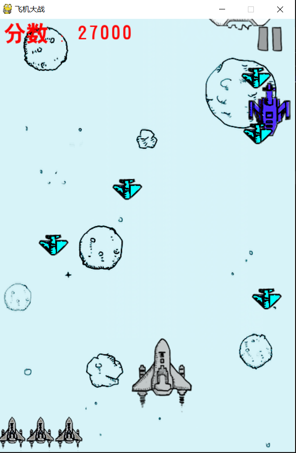

# 飞机大战:airplane:
## 快速入门
### 先决条件
你的电脑上必须先安装Python3，程序才能运行。
### 安装使用
下载压缩包，解压到本地，点击运行main.py文件，程序开始运行。
## 运行测试
### 运行效果

## 如何创建
### 使用技术
* Python3.0
* Pygame
### 开发工具
* Pycharm
## 作者
* **张明珂**-*创建*
## 致谢
* 感谢室友提供的创作灵感
* 菜鸟教程
* 廖雪峰

